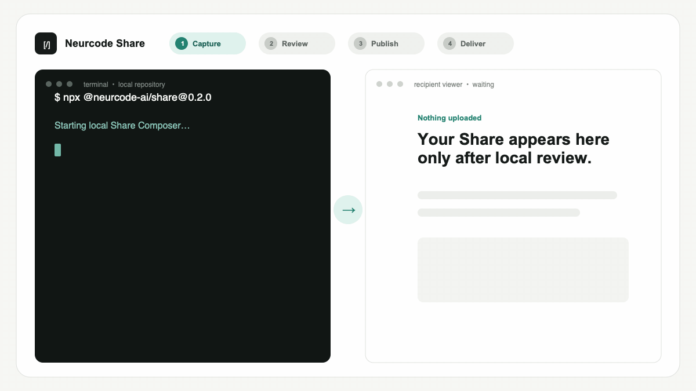

# Neurcode Share

Select the exact code once. One canonical Share becomes a readable review for
a teammate or bounded Markdown, JSON, or archive context for an AI agent.

Neurcode Share is the open format, CLI, SDK, and viewer for creating a bounded,
reviewable code handoff. The hosted service at
[share.neurcode.com](https://share.neurcode.com) publishes that handoff as a
link when you choose to.

## 15-second quick start

From any Git repository:

```sh
npx @neurcode-ai/share@0.3.0
```

The Composer binds only to loopback, inventories the exact disclosure, scans
for sensitive material, and creates nothing remotely unless you explicitly
choose Publish.

For a non-interactive local archive:

```sh
npx @neurcode-ai/share@0.3.0 src/auth.ts:20-80 --diff --yes --out review.tar.gz
```

## One canonical Share, native representations



Select the exact material, review the disclosure cut locally, then publish one
immutable revision and one URL. A person gets inert readable HTML; an AI agent
gets the equivalent bounded Markdown, JSON, or verified archive without the
creator manually repackaging anything. The example uses the released `0.3.0`
CLI and the same canonical Share as this
[public focused-review Share](https://share.neurcode.com/examples/code-review).

## Three public workflows

| Workflow | What the recipient gets | Open |
| --- | --- | --- |
| Focused code review | Implementation, complete diff, relevant test, passing evidence, and one review question | [View Share](https://share.neurcode.com/examples/code-review) |
| Debugging handoff | Failing path, bounded reproducer, observed failure, controls, and an asserted hypothesis | [View Share](https://share.neurcode.com/examples/debugging-handoff) |
| AI-agent handoff | Cited task scope, current work, contract context, evidence, remaining work, and trust guidance | [View Share](https://share.neurcode.com/examples/ai-agent-handoff) |

See [public Share examples](docs/EXAMPLES.md) for the included and excluded
scope plus direct Markdown and JSON delivery.

## Local-only usage

Local creation needs no account. Export a deterministic archive, inert HTML,
Markdown, or agent JSON:

```sh
npx @neurcode-ai/share@0.3.0 src/queue.ts --yes --out queue-review.html
npx @neurcode-ai/share@0.3.0 --staged --yes --out staged-review.md
npx @neurcode-ai/share@0.3.0 --diff=main..HEAD --yes --out change.json
npx @neurcode-ai/share@0.3.0 --run "pnpm test queue" --yes --out evidence.tar.gz
```

Commands are bounded by time and output limits. Sensitive paths are denied by
default. The disclosure airlock runs before any file is written or uploaded.

Verify exact cited bytes against a selected local repository state, or prepare
a reviewed immutable successor without publishing:

```sh
npx @neurcode-ai/share@0.3.0 verify review.tar.gz --repo ../project
npx @neurcode-ai/share@0.3.0 refresh review.tar.gz --decision i2=use --output refreshed.tar.gz
```

See the [CLI guide](packages/cli/README.md) for deterministic JSON, named
revisions, staged comparisons, explicit refresh decisions, hosted checks,
and authorized comments.

## Hosted publishing

Add `--publish` after reviewing the local cut. Publishing uses the existing
Neurcode identity and a loopback PKCE flow, so no hosted token is copied into
the terminal:

```sh
npx @neurcode-ai/share@0.3.0 src/session.ts --publish --visibility unlisted
```

The hosted service at [share.neurcode.com](https://share.neurcode.com) is
proprietary and is not implemented in this repository. Its documented client
contract is available through `@neurcode-ai/share-sdk`.

## Recipient workflows

For a person, send the viewer link. They see the question, selected context,
provenance, and comments subject to the Share's access policy.

For an AI agent, use the same accessible URL with content negotiation, an
adjacent canonical representation, or create a short-lived, revision-pinned
agent link in the hosted library and fetch its scoped format:

```sh
npx @neurcode-ai/share@0.3.0 fetch 'AGENT_LINK' --stdout md
```

Capability and agent secrets remain in URL fragments at rest and are sent in
request headers, not request paths.

## What is in a Share?

A Share archive contains canonical `cut.json`, narrative `story.json`,
provenance `pins.json`, and content-addressed blobs. The digest excludes
wall-clock capture time but includes the selected content, intent, evidence,
and provenance. Identical meaningful inputs therefore produce identical
identity.

The [source-free example](examples/source-free-handoff.json) demonstrates the
metadata a recipient can inspect without publishing real source.

## Privacy and security boundary

- Capture, selection, scanning, review, and export happen locally.
- No account is required until hosted publishing.
- Paths, archive sizes, expanded bytes, item counts, commands, and timeouts are
  bounded.
- Archives reject traversal, links, malformed records, digest mismatches, and
  expansion bombs.
- Renderers treat all captured material as inert text.
- Secret scanning reduces risk but cannot prove that content is safe; the human
  disclosure review remains authoritative.

See [privacy](docs/PRIVACY.md), the [threat model](docs/THREAT_MODEL.md), and
[format compatibility](docs/FORMAT_COMPATIBILITY.md).

## Compared with paste, Gist, and pull requests

| Tool | Exact provenance | Local disclosure review | Bounded evidence | Agent formats | Hosted collaboration |
| --- | --- | --- | --- | --- | --- |
| Chat paste | rarely | no | no | prose | chat-specific |
| Gist | commit-level | no | no | source | link and comments |
| Pull request | strong | diff review | CI-dependent | diff/API | repository workflow |
| Neurcode Share | content pins and digest | yes | yes | Markdown, JSON, archive | optional |

Share complements pull requests when the review context is smaller, unfinished,
cross-file, or intended for an external person or agent.

## Packages

- `@neurcode-ai/share-format`: schema, archive, verifier, renderers, scanner
- `@neurcode-ai/share`: focused CLI and local Composer
- `@neurcode-ai/share-viewer`: verified local/static rendering helpers
- `@neurcode-ai/share-sdk`: public hosted client contracts

## Current limitations

- Text/code files only; binary assets are not captured.
- A Share contains an explicit cut, not a live repository mirror.
- Secret scanning is heuristic.
- Hosted publishing depends on the separately operated Neurcode service.
- Browser-only hosted creation is available at
  [share.neurcode.com/new](https://share.neurcode.com/new), not in this
  open-core repository.

## Contributing

Read [CONTRIBUTING.md](CONTRIBUTING.md), [GOVERNANCE.md](GOVERNANCE.md), and
the [release policy](docs/RELEASE_POLICY.md). Security reports should follow
[SECURITY.md](SECURITY.md).

Apache-2.0 covers Neurcode-owned source here. Trademarks remain reserved as
described in [TRADEMARKS.md](TRADEMARKS.md).
