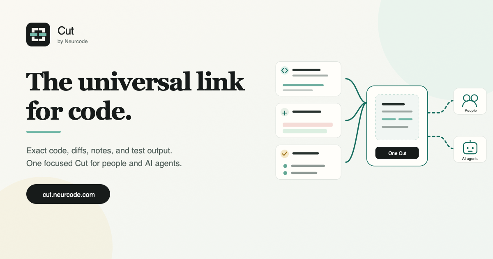

<p align="center">
  
</p>

<h1 align="center">Cut by Neurcode</h1>

<p align="center"><strong>The universal link for code.</strong></p>

[](https://www.npmjs.com/package/@neurcode-ai/cut)
[](LICENSE)
[](package.json)

Select the exact code once. One canonical
Cut becomes a readable review for a teammate or bounded Markdown, JSON, or
archive context for an AI agent. A recipient can reply with another Cut, and
an eligible code reply can be tried in isolation before it is applied.

[Create in the browser](https://cut.neurcode.com/new) ·
[Explore examples](https://cut.neurcode.com/examples) ·
[Learn about Teams](https://cut.neurcode.com/teams) ·
[Read the privacy boundary](docs/PRIVACY.md)

Cut by Neurcode is the open format, CLI, SDK, and viewer for creating a bounded,
reviewable code handoff. The hosted service at
[cut.neurcode.com](https://cut.neurcode.com) publishes that handoff as a
link when you choose to.

## 15-second quick start

From any Git repository:

```sh
npx @neurcode-ai/cut@0.5.0
```

The local Composer asks Git for the changed, staged, and non-ignored untracked
files in the current directory subtree. It proposes that bounded working set
without an LLM or remote inference. Remove any item, add the question, then
review the exact disclosure; nothing is uploaded unless you explicitly choose
Publish.

For a non-interactive local archive:

```sh
npx @neurcode-ai/cut@0.5.0 src/auth.ts:20-80 --diff --yes --out review.tar.gz
npx @neurcode-ai/cut@0.5.0 --message "Review this working set" --yes --out working-set.tar.gz
```

## One canonical Cut, native representations



Select the exact material, review the disclosure boundary locally, then publish one
immutable revision and one URL. A person gets inert readable HTML; an AI agent
gets the equivalent bounded Markdown, JSON, or verified archive without the
creator manually repackaging anything. The example uses the released Cut CLI
and the same canonical Cut as this
[public focused-review Cut](https://cut.neurcode.com/examples/code-review).

## Three public workflows

| Workflow | What the recipient gets | Open |
| --- | --- | --- |
| Focused code review | Implementation, complete diff, relevant test, passing evidence, and one review question | [View Cut](https://cut.neurcode.com/examples/code-review) |
| Debugging handoff | Failing path, bounded reproducer, observed failure, controls, and an asserted hypothesis | [View Cut](https://cut.neurcode.com/examples/debugging-handoff) |
| AI-agent handoff | Cited task scope, current work, contract context, evidence, remaining work, and trust guidance | [View Cut](https://cut.neurcode.com/examples/ai-agent-handoff) |

See [public Cut examples](docs/EXAMPLES.md) for the included and excluded
scope plus direct Markdown and JSON delivery.

## Local-only usage

Local creation needs no account. Export a deterministic archive, inert HTML,
Markdown, or agent JSON:

```sh
npx @neurcode-ai/cut@0.5.0 src/queue.ts --yes --out queue-review.html
npx @neurcode-ai/cut@0.5.0 --staged --yes --out staged-review.md
npx @neurcode-ai/cut@0.5.0 --diff=main..HEAD --yes --out change.json
npx @neurcode-ai/cut@0.5.0 --run "pnpm test queue" --yes --out evidence.tar.gz
```

Commands are bounded by time and output limits. Sensitive paths are denied by
default. The disclosure airlock runs before any file is written or uploaded.

Verify exact cited bytes against a selected local repository state, or prepare
a reviewed immutable successor without publishing:

```sh
npx @neurcode-ai/cut@0.5.0 verify review.tar.gz --repo ../project
npx @neurcode-ai/cut@0.5.0 refresh review.tar.gz --decision i2=use --output refreshed.tar.gz
```

See the [CLI guide](packages/cli/README.md) for deterministic JSON, named
revisions, staged comparisons, explicit refresh decisions, hosted checks,
and authorized comments.

## Try and apply suggested edits

An eligible hosted reply may carry exact suggested edits while remaining a
normal immutable Cut. Preview it in a retained sparse worktree, or apply it
interactively after reviewing the full diff:

```sh
npx @neurcode-ai/cut@0.5.0 try 'https://cut.neurcode.com/c/REPLY_ID'
npx @neurcode-ai/cut@0.5.0 try --list
npx @neurcode-ai/cut@0.5.0 apply 'https://cut.neurcode.com/c/REPLY_ID'
```

Neither command runs source, commands, tests, or hooks, commits, or pushes.
`try` does not copy unrelated working files or change the current worktree;
`apply` has no force/non-interactive bypass and creates private recovery
material before writing. See [Cut Try and Apply](docs/CUT_TRY.md) and the
[Applyable Replies V1 format](docs/APPLYABLE_REPLIES_V1.md).

Use `cut inbox` for a bounded source-free Waiting/Answered view of authorized
personal and team conversations. Its stable JSON contract and pagination are
documented in [Cut Inbox](docs/CUT_INBOX.md).

For the full send, reply, try, and apply sequence, plus solo, teammate, AI, and
team jobs, see [Cut workflows](docs/WORKFLOWS.md).

## Hosted publishing

Add `--publish` after reviewing the local cut. Publishing uses the existing
Neurcode identity and a loopback PKCE flow, so no hosted token is copied into
the terminal:

```sh
npx @neurcode-ai/cut@0.5.0 src/session.ts --publish --visibility unlisted
```

The hosted service at [cut.neurcode.com](https://cut.neurcode.com) is
proprietary and is not implemented in this repository. Its documented client
contract is available through `@neurcode-ai/share-sdk`.

Cut for Teams Beta uses the same disclosure review and browser authorization.
List the exact slugs available to your signed-in account, then use `--to`; this
implies hosted publishing and keeps the Cut inside the team-only shared inbox:

```sh
npx @neurcode-ai/cut@0.5.0 teams
npx @neurcode-ai/cut@0.5.0 src/queue.ts --to platform-engineering-a1b2c3 --yes
```

With the package installed, the same workflow is `cut teams` followed by
`cut src/queue.ts --to <team-slug> --yes`.

Team membership and the destination slug are revalidated by the server during
finalization. Public visibility and external recipient flags are rejected for
team Cuts during Beta.

To publish an independent Cut as a reply to a current hosted Cut, pass its
canonical ID or URL. Parent access is checked again inside finalization; the
reply keeps its own visibility, recipients, expiry, provenance, and revision:

```sh
npx @neurcode-ai/cut@0.5.0 src/reply.ts --reply-to shr_PARENT_ID --publish
printf '%s\n' "$CUT_REPLY_URL" | npx @neurcode-ai/cut@0.5.0 src/reply.ts --reply-to - --publish
```

Capability-bearing URLs may be retained in shell history when supplied as an
argument. Prefer the stdin form above. A local export made with `--reply-to`
remains an ordinary Cut archive; the reply relation exists only after hosted
publication and is never added to the portable format.

## Recipient workflows

For a person, send the viewer link. They see the question, selected context,
provenance, and comments subject to the Cut's access policy.

For an AI agent, use the same accessible URL with content negotiation, an
adjacent canonical representation, or create a short-lived, revision-pinned
agent link in the hosted library and fetch its scoped format:

```sh
npx @neurcode-ai/cut@0.5.0 fetch 'AGENT_LINK' --stdout md
```

Capability and agent secrets remain in URL fragments at rest and are sent in
request headers, not request paths.

## What is in a Cut?

A Cut archive contains canonical `cut.json`, narrative `story.json`,
provenance `pins.json`, and content-addressed blobs. The digest excludes
wall-clock capture time but includes the selected content, intent, evidence,
and provenance. Identical meaningful inputs therefore produce identical
identity.

The [source-free example](examples/source-free-handoff.json) demonstrates the
metadata a recipient can inspect without publishing real source.

## Privacy and security boundary

- Capture, selection, scanning, review, and export happen locally.
- No account is required until hosted publishing.
- Paths, archive sizes, expanded bytes, item counts, commands, and timeouts are
  bounded.
- Archives reject traversal, links, malformed records, digest mismatches, and
  expansion bombs.
- Renderers treat all captured material as inert text.
- Secret scanning reduces risk but cannot prove that content is safe; the human
  disclosure review remains authoritative.

See [privacy](docs/PRIVACY.md), the [threat model](docs/THREAT_MODEL.md), and
[format compatibility](docs/FORMAT_COMPATIBILITY.md).

## Compared with paste, Gist, and pull requests

| Tool | Exact provenance | Local disclosure review | Bounded evidence | Agent formats | Hosted collaboration |
| --- | --- | --- | --- | --- | --- |
| Chat paste | rarely | no | no | prose | chat-specific |
| Gist | commit-level | no | no | source | link and comments |
| Pull request | strong | diff review | CI-dependent | diff/API | repository workflow |
| Cut by Neurcode | content pins and digest | yes | yes | Markdown, JSON, archive | optional |

Cut complements pull requests when the review context is smaller, unfinished,
cross-file, or intended for an external person or agent.

## Packages

- `@neurcode-ai/cut`: primary product entry point
- `@neurcode-ai/share-format`: schema, archive, verifier, renderers, scanner
- `@neurcode-ai/share`: compatible CLI engine and legacy entry point
- `@neurcode-ai/share-viewer`: verified local/static rendering helpers
- `@neurcode-ai/share-sdk`: public hosted client contracts

## Current limitations

- Text/code files only; binary assets are not captured.
- A Cut contains an explicit cut, not a live repository mirror.
- Secret scanning is heuristic.
- Hosted publishing depends on the separately operated Neurcode service.
- Browser-only hosted creation is available at
  [cut.neurcode.com/new](https://cut.neurcode.com/new), not in this
  open-core repository.

## Contributing

Read [CONTRIBUTING.md](CONTRIBUTING.md), [GOVERNANCE.md](GOVERNANCE.md), and
the [release policy](docs/RELEASE_POLICY.md). Security reports should follow
[SECURITY.md](SECURITY.md).

Apache-2.0 covers Neurcode-owned source here. Trademarks remain reserved as
described in [TRADEMARKS.md](TRADEMARKS.md).
